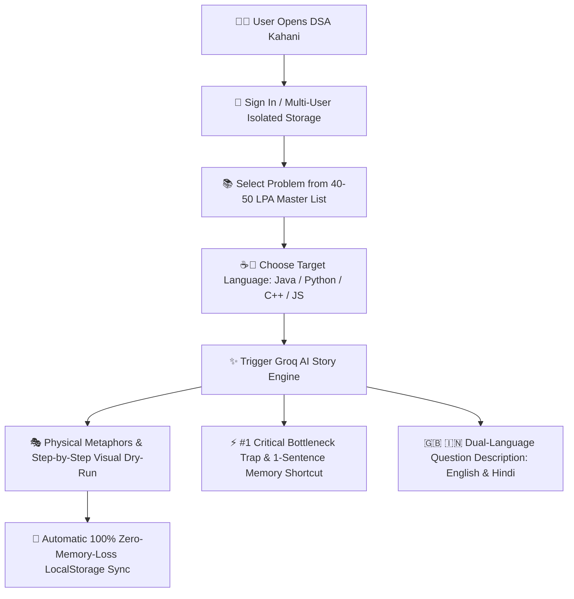

# 📚 DSA Kahani (Data Story Algorithm)

> **Master Data Structures & Algorithms through Relatable Real-Life Stories, Physical Metaphors, and Zero-Memory-Loss Bottlenecks!**


---

## 🌟 Visual Application Flow



---

## 🌟 Key Features

| Feature | Description |
| :--- | :--- |
| 🎭 **Step-by-Step Hinglish Stories** | Replaces dry math jargon with physical real-world metaphors (*Shaadi Matchmaker*, *Share Bazaar Trader*, *Pizza Slicing*). |
| ⚡ **Unforgettable Bottlenecks** | Highlights the **#1 Critical Trap** (TLE loops, index traps) + **1-sentence memory trick**. |
| ☕🐍 **Multi-Language Code** | Generates solution code in **Java**, **Python**, **C++**, or **JavaScript** with Hinglish line comments. |
| 🇬🇧🇮🇳 **Dual-Language Question View** | 1-Click toggle between **English** and **Hindi / Hinglish** problem statements. |
| 🎯 **Study-Focused Focus Mode** | 1-Click collapse of side navigation for 100% deep concentration. |
| 🖥️ **Distraction-Free Fullscreen** | Fullscreen viewing & live editing for Code, Question, and Mindful Story. |
| 🔒 **Isolated Multi-User Storage** | Every user account gets private, non-conflicting LocalStorage namespaces. |
| 📱 **Mobile & Tablet Responsive** | Touch-optimized slide-out drawer navigation and mobile view tab switchers. |

---

## 📱 Mobile & Tablet Responsive Experience


---

## 🛠️ Tech Stack

- **Frontend Core:** React 18, JSX, ES6+ JavaScript
- **Build Tooling:** Vite 5
- **Styling:** Custom Vanilla CSS (Pure White & Royal Blue Light Mode + ChatGPT Dark Mode with Emerald Green `#10a37f` Accent)
- **AI Intelligence:** Groq API (`llama-3.3-70b-versatile`)
- **Icons:** `lucide-react`
- **Hosting / Deployment:** Vercel

---

## 🚀 Quick Start Guide

### 1. Clone the Repository
```bash
git clone https://github.com/tushar-kumar-9354/Dsa-story.git
cd Dsa-story
```

### 2. Install Dependencies
```bash
npm install
```

### 3. Set Up Environment Variables
Create a `.env` file in the project root:
```env
VITE_GROQ_API_KEY=your_groq_api_key_here
```

### 4. Run Development Server
```bash
npm run dev
```
Open `http://localhost:5173` in your browser.

---

## 📦 Production Build & Vercel Deployment

### Build Locally
```bash
npm run build
```

### Deploy to Vercel in 1 Minute
```bash
npx vercel
```
*Note: `vercel.json` is pre-configured for SPA routing.*

---

## 📄 License
Distributed under the **MIT License**. See `LICENSE` for more information.
